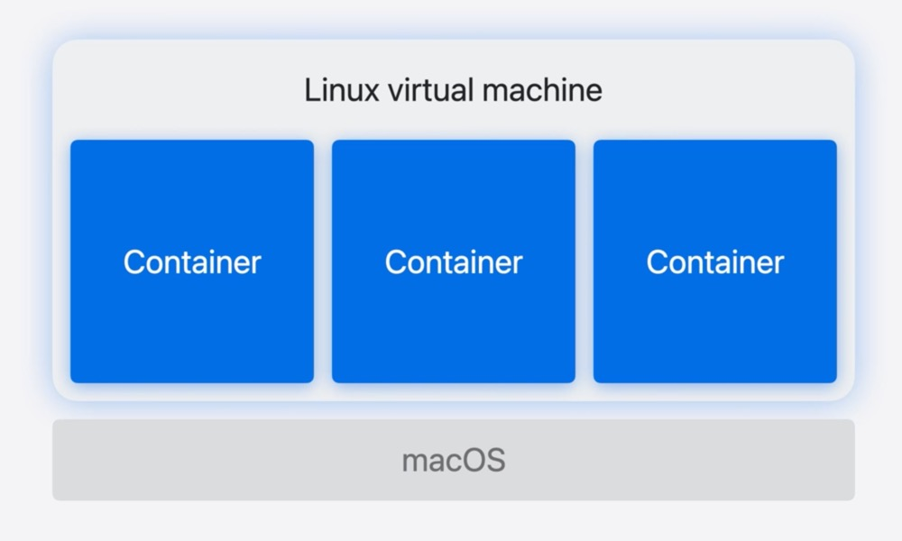
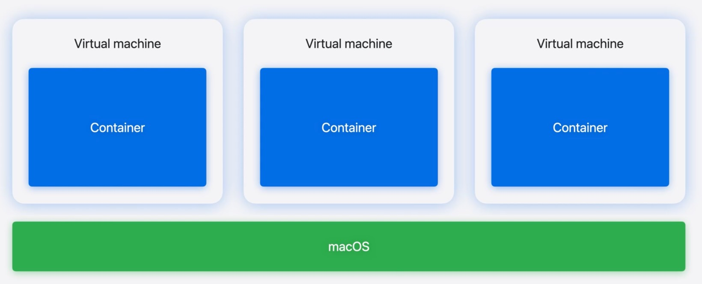
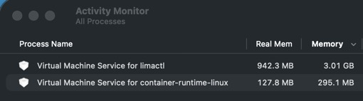
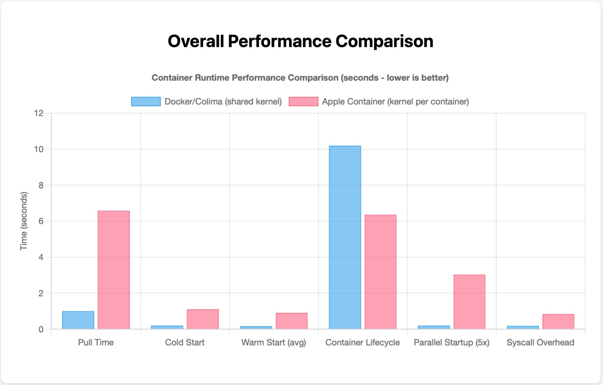
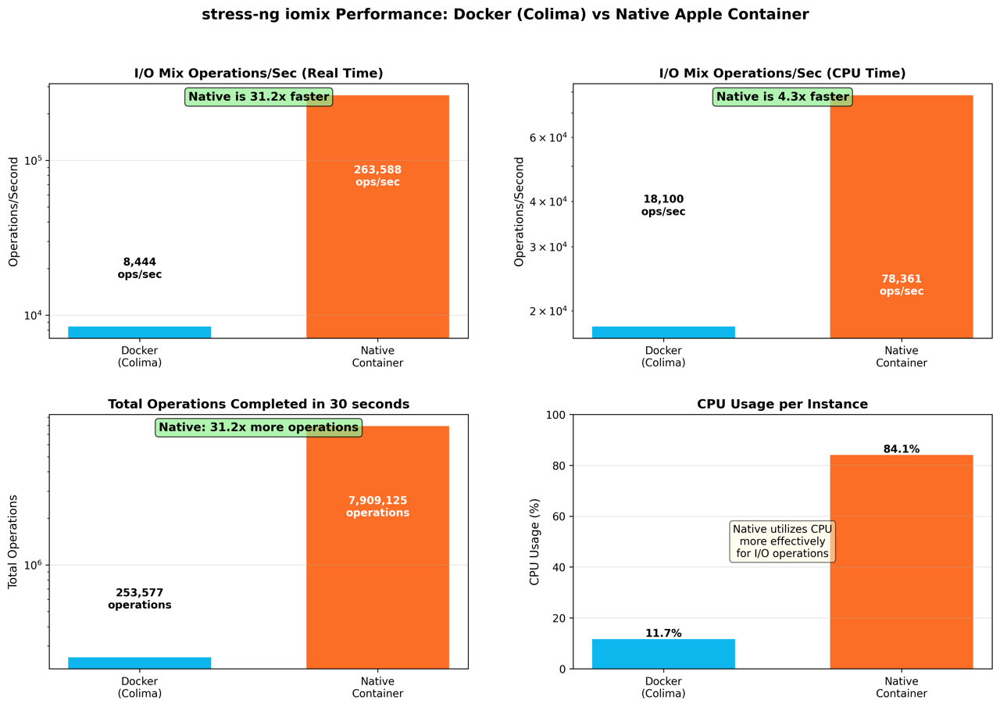
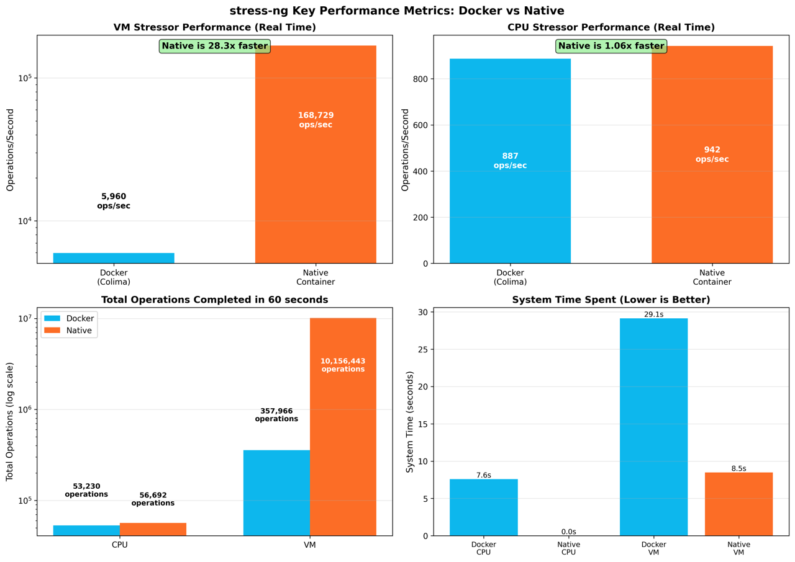
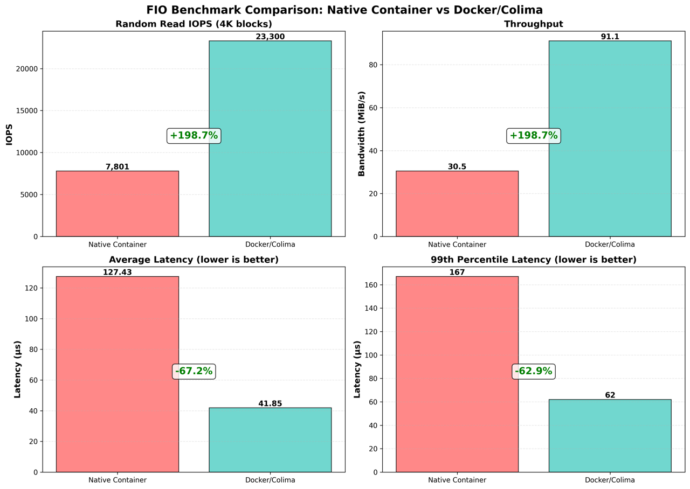
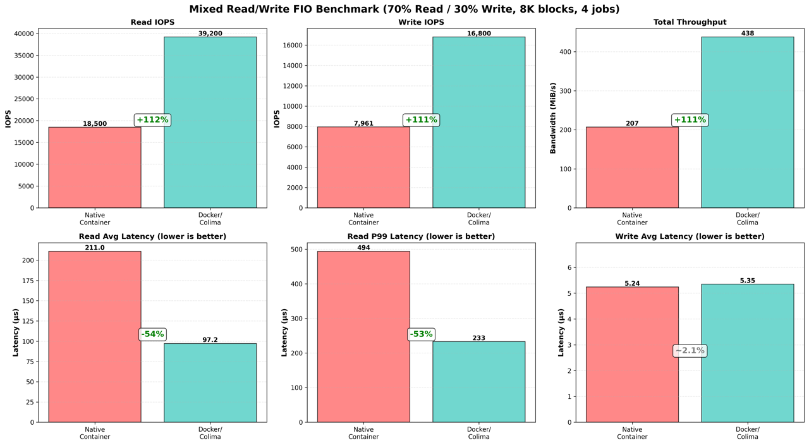
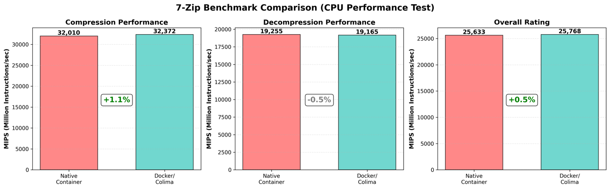

+++
date = '2025-10-28T00:07:00-05:00'
draft = false
title = 'Containers'
+++
# Apple’s Native Containers in macOS 26

With the furor around Liquid Glass, it’s easy to miss that in the latest release of macOS, Apple has quietly added their own unique take on containers.

### Containers?

If you’re reading this, you’re probably somewhat familiar with containers. Just in case, I’ll give a condensed explanation.

Containerization is the practice of packaging an application together with all of its underlying dependencies into a tidy bundle that can be distributed and run on any platform with supported architecture. Namespaces and cgroups (both features of the Linux kernel) confine what the container can see and keep its resource usage within specified limits. The result is an application running in an isolated environment without the associated bloat of virtualizing an entire operating system.

We need a Linux kernel since we’re using Linux kernel features. In the past, that meant that in Docker (the most popular containerization platform) on MacOS you’re running a single Linux VM and all of your containers run within it.

When I say “Docker” for the purpose of the post, I’ll be referring to [Docker CLI](https://www.docker.com/products/cli/) running as the management layer, backed by [Colima](https://github.com/abiosoft/colima) handling the underlying virtualization.  
  
Colima leans on the Apple native [Virtualization.framework](https://developer.apple.com/documentation/virtualization) that premiered in macOS 11 to run the Linux VM that hosts the containers for Docker. You specify how much memory to allocate to Colima’s VM container host at launch and that memory is immediately allocated, although you’ll only be using a fraction of it through the magic of Virtualization.framework’s [memory balloon device](https://developer.apple.com/documentation/virtualization/vzvirtiotraditionalmemoryballoondevice).

* * *

### What makes Apple’s container runtime different?

_A note on nomenclature: Apple named their API and CLI tools for working with Linux containers a bit generically._ [_The_](https://github.com/apple/containerization) _framework for working with containers is called_ [_containerization and_](https://github.com/apple/container) _the actual tool itself is called container. Apple’s container runtime requires macOS 15+ and Apple Silicon to operate, with macOS 26 required for full functionality._

With the CLI tool container, Apple is blurring the lines between traditional containerization and virtualization. Instead of hosting containers in a shared VM, Apple has chosen to give each container its own virtual machine - complete with its own ext4-based block storage, IP address, and user-definable CPU & memory limits. On M3 or newer hardware, you can even [nest virtualization inside of a container.](https://github.com/apple/container/blob/main/docs/how-to.md#expose-virtualization-capabilities-to-a-container) (We’re all thinking the same infinite recursion joke, right?)

  

The first time you launch the container system via ‘container system start’, you’ll notice something: there’s zero delay. With no host VM to launch, you press enter and you’re immediately back at a prompt. It’s nice compared to the ~15 second wait of starting Colima.

  
Much like Colima, Apple uses their Virtualization.framework to host these per-container virtual machines. Apple containers don’t share resources, so you can independently assign resources per-container instead of having to account for total consumption at the VM layer or risk OOMKills. The containerization framework also uses memory balloon devices in its implementation Virtualization.framework, and it manages the allocated real memory even more aggressively than Colima.

Apple’s container runtime follows the [Open Containers Initiative](https://opencontainers.org) image & runtime spec. This means your current Docker/Podman/Kubernetes images & registries are compatible. Apple’s Rosetta 2 translation layer is also supported, allowing you to run amd64 images on Apple Silicon through the use of the —platform flag.

When the container runtime launches for the first time, it will fetch the kernel that it uses when running container images. In version 0.50 (current as of this writing), it uses a [v6.12.28 aarch64 Linux Kernel](https://cdn.kernel.org/pub/linux/kernel/v6.x/ChangeLog-6.12.28) from the [Kata Containers](https://katacontainers.io) v3.17.0 release in May of 2025.

* * *

### Using the container runtime

If you’re familiar with Docker’s CLI syntax, you’ll feel right at home. The team behind container has kept the syntax almost entirely unchanged. I’ve read accounts of people swapping Docker for Podman and aliasing “docker” to “podman” and going on with their lives without encountering any issues. That would _almost_ work here too. (“container run —help | wc -l” returns a count of 70 lines. The same command on Docker returns 112 lines, so you might find some options missing.)

The one notable difference is that when launching the container, you’re configuring the CPU and memory count of the VM. If you aren’t happy with a given container’s baked-in defaults, you’ll need to [add those flags.](https://github.com/apple/container/blob/main/docs/command-reference.md)

* * *

### Benchmarks

Hardware: M1 Pro with 32GB of RAM running MacOS 26.0.1 using the internal SSD.

Versions: Apple container runtime v0.50, Docker CLI 28.5.1 (client), 28.4.0 (server) and Colima 0.9.1

Containers used for benchmarking: stress-ng, fio, 7zip

[Link to commands used and benchmark output as text.](https://gist.github.com/VerilyPete/bf2f09070c9539e87a44646f8374109e)

[Link to Gist with benchmarks comparing Docker and container startup and lifecycle.](https://gist.github.com/VerilyPete/98a2281bdb5f8f336f732c69f3e338a9)

We’ll start off with a small suite of simple benchmarks that I threw together in Cursor to test the following: pulling a container, container cold start, warm start, lifecycle (create, run, rm), starting 5 containers in parallel, and creating 1000 temp files. You can find the script in the Gist above.

My takeaways from this chart:

- Docker pulls containers much faster.
- Docker’s much slower at creating containers, which leads to the Lifecycle result.
- Every other test shows the advantage of already having that VM running when you start the container. Apple’s native container runtime reliably returned sub-second starts as advertised.

* * *

We’ll move on to the stress-ng, fio & 7zip benchmarks. You can find the exact syntax used to launch these benchmarks and the output in the first Gist above.

[stress-ng](https://github.com/ColinIanKing/stress-ng) is a Linux stress-testing tool for system burn-in and benchmarking. It has hundreds of built-in methods of abusing a machine. I chose to use a couple of tests that exercise I/O, CPU utilization, and memory read/write speed.

We’ll start with stress-ng running its “iomix” I/O suite on 4 workers simultaneously for 30 seconds.

For this test, the native container runtime made better use of its CPU and trounced Docker. It used 73% more of its CPU to reliably return 31x more I/O Mix operations.

The next test has stress-ng running 4 CPU stressors and 2 memory stressors in parallel for 30 seconds.

- CPU performance was evenly matched, while memory performance strongly favored the native implementation.
- The native CPU results seemed silly. If you check the text output, it’s actually 0.02% system time. The CPU operations of this test run almost entirely in userspace, so the low kernel utilization makes sense.

* * *

[Fio](https://github.com/axboe/fio) is the Flexible I/O tester. Its raison d’être is running reproducible I/O load testing in any number of shapes. I criminally underutilized it with the pair of tests that I ran, starting with this test that performed 10 seconds of 4k reads on a single worker.

We see an interesting shift that cannot be explained here. Fio shows the opposite of the previous results, with Docker performing substantially better than the native container runtime.

That result holds up as we move on to a test that performs a mix of 70% read and 30% write on 8k blocks across four simultaneous workers.

* * *

The final test I ran was 7zip’s “b” benchmark, where we hammered on the CPU as it compressed and then decompressed data with the LZMA algorithm.

This final test supports the earlier CPU-based benchmarks with very similar results. We’re near (or under) 1% difference in every category.

* * *

### Final thoughts

Overall, Apple’s native runtime feels promising. It offers levels of isolation previously only seen in much bulkier VMs, solid CPU and memory performance, somewhat inconsistent I/O performance, and the delightfully low memory utilization with running containers - and near zero utilization when those containers are stopped.

Not bad for v0.50.

I’m watching the GitHub repo and planning on adopting the native container runtime for use with the dev containers plugin in Cursor/VSCode.