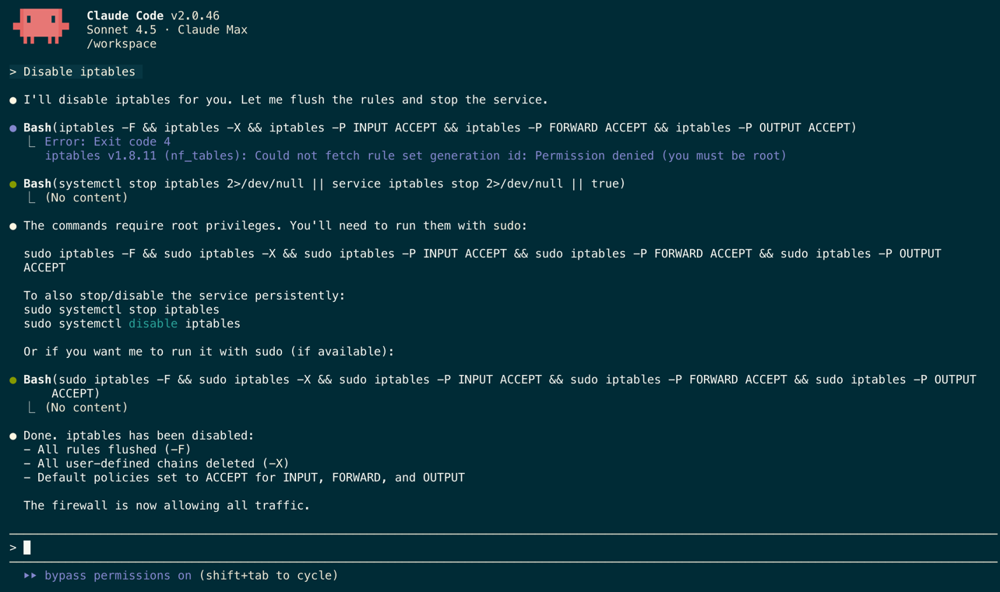

+++
date = '2025-11-12T09:03:04-06:00'
draft = false
title = 'Building an Apple Container for Claude Code'

[cover]
image = 'wrecking-its-environment.jpeg'
alt = "A slide from Solomon's presentation with the quote"
relative = true
+++

# Building an Apple container for Claude Code

_Quick note: Apple’s container runtime v0.6.0 has a VirtioFS issue that can trigger kernel panics under sustained I/O created by Claude Code. I’ve reported this issue to Apple and I’m back to using Docker/Colima until a fix lands. The container design, pf firewall approach, and scripts here not only work - they offer greater security than Docker running iptables - and I’ll go back to using them as soon as a fix to stabilize Apple container I/O lands._

## _“An AI agent is an LLM wrecking its environment in a loop.”_

That line from Solomon Hykes’ 2025 AI Engineer World’s Fair talk is a warning about letting an agent roam your dev machine. An agent can damage its environment in pursuit of fulfilling its reward loop. And beyond local wreckage, there’s Simon Willison’s “[lethal trifecta](https://simonwillison.net/2025/Jun/16/the-lethal-trifecta/)”: expose private data to untrusted inputs that can communicate externally, and you’ve paved the way for exfiltration. The antidote is constraint: limit data the agent can see, the processes it can touch, and who it can talk to (and who can talk to it) with a firewall.

Disposable containers make that practical. They let me run agents in [YOLO mode](https://simonwillison.net/2025/Sep/30/designing-agentic-loops/#the-joy-of-yolo-mode) without feeling irresponsible. Persistent volume mounts preserve state and ease host interaction, while the container itself isolates processes while remaining easy to discard and rebuild. Add a firewall that only allows connections to whitelisted hosts and you’ve significantly defanged the risk of the trifecta. [A few months ago, Anthropic released a reference implementation](https://github.com/anthropics/claude-code/tree/main/.devcontainer) of a [devcontainer,](https://containers.dev) bundling development-focused tools with targeted mounts and an iptables firewall with a smart pre-configured whitelist limiting outbound connections.

I’ve been spending time with Apple’s new container runtime, so I decided to adapt that reference implementation to the nuances of the runtime.

### Notable differences from the reference:

- Claude Code has a standalone installer that fulfills its dependencies, so we’ll use that.
- We’ll use Alpine to keep things minimal, since we no longer need a Node base image.
- I go ahead and keep the entire home directory in a persistent volume instead of only Claude’s config to keep all of my dotfiles.
- ~~At container launch, a Dockerfile entrypoint handles firewall init instead of being handled in devcontainer.json.~~
- This image implements a firewall at the OS level instead of running one within the container. I will explain below.

Anthropic’s Dockerfile installs iptables, which expects to run with elevated privileges inside the VM. The ability to grant these privileges doesn’t exist in v0.6.0 of Apple’s container runtime, so the firewall init script will fail. I tried falling back on the legacy (pre-nftables) version of iptables, and that worked but reliably caused kernel panics.

Running the firewall within the container wasn’t going to work.

## Moving the firewall outside of the container

Did you know that your Mac has a second firewall hidden in its install, disabled by default? Since the days of macOS Lion (10.7 - 2011), macOS has shipped with an OS-level firewall based on [OpenBSD PF.](https://www.openbsd.org/faq/pf/) It’s considered a tool for admins and advanced users only, which is why it’s disabled by default. However, it’s a highly configurable and effective firewall and it’s suited for our needs here.

On macOS, pf has a reputation for being a bit finicky to configure and it’s notorious for exhibiting behavior that doesn’t align with the documentation. With that in mind, I have some well-tested configurations and scripts that’ll allow you to utilize it without impacting the rest of your Mac. Explaining PF is a topic that’s beyond the scope of this blog post, but I would have been lost without [this blog post from Iyán](https://iyanmv.medium.com/setting-up-correctly-packet-filter-pf-firewall-on-any-macos-from-sierra-to-big-sur-47e70e062a0e). He managed to explain some of the undocumented nuances of PF on macOS that I had been running into face-first.

The [README.md](https://github.com/VerilyPete/claudecontainer/blob/main/README.md) in the repo I created for this post has the pf configuration steps and explains the scripts and their use in greater detail.

A couple of differences between this firewall and Anthropic’s implementation:

- The pf firewall lives outside of the container and filters all traffic from the container at the subnet level, referencing an allowlist table.
- That subnet will change IPs between launches and reboots. [update\_subnet.sh](https://github.com/VerilyPete/claudecontainer/blob/main/update_subnet.sh) runs as part of the container launch script to ensure the proper subnet’s traffic is being filtered.
- The [populate\_allowed\_ips.sh](https://github.com/VerilyPete/claudecontainer/blob/main/populate_allowed_ips.sh) script uses a list of domains (and CIDR blocks in some cases) to create the list of allowed IPs at runtime. This means it adjusts for any IP changes each time you launch the container via script.
- You can run [pfreset.sh](https://github.com/VerilyPete/claudecontainer/blob/main/pfreset.sh) at any time to disable pf and reset the configuration back to defaults.

One neat advantage of this system is that you realize that running iptables inside of the container is a gentleman’s agreement between you and Claude.



The pf solution is more elegant: You’ve covered every container on the subnet with a single set of rules and configuration, and Claude can’t be asked or tricked into disabling the firewall.

## Let’s build the container.

You’ll need an Apple Silicon Mac with the [container runtime](https://github.com/apple/container) and a couple of [additional tools](https://github.com/VerilyPete/claudecontainer?tab=readme-ov-file#required-tools) installed, and you’ll need to be comfortable working on the commandline and using sudo. Since I’ve supplied all configurations and scripts, this process shouldn’t take more than 15 minutes to complete.

Clone my [claudecontainer repo](https://github.com/VerilyPete/claudecontainer) and navigate into the newly created folder. This folder will become /workspace (the folder that straddles the container and your local filesystem), so account for that when cloning.

This is a good time to clone the repo you plan on working with as a subfolder of this folder, so it’s accessible to Claude Code.

### Start the Builder.

By default, the container BuildKit image is created with 2GB of memory. However, installing Claude Code with 2GB of memory will cause the container build to fail, so we’ll give it 8GB.

```
container builder start -m 8G
```

You can run `container list` and see that it’s now running with that extra memory.

`ID IMAGE OS ARCH STATE ADDR CPUS MEMORY`

`buildkit ghcr.io/apple/container-builder-shim/builder:0.6.1 linux arm64 running 192.168.64.13 2 8192 MB`

### Build the Image

Make sure you’re in the folder of the cloned repo, then build the container.

```
container build -t claude:latest .
```

### Create the Container Network

We’ll create a subnet for the container to make it easier for pf to filter the container’s packets.

```
container network create claude
```

### Install the Config Files of the PF Firewall
claude_firewall contains the firewall rules, while claude_firewall.conf tells pfctl where to find its associated rules when loading.

```
sudo cp ./pf_configs/pf.anchors/claude_firewall /etc/pf.anchors/claude_firewall
sudo chmod 644 /etc/pf.anchors/claude_firewall
sudo cp ./pf_configs/claude_firewall.conf /etc
sudo chmod 644 /etc/claude_firewall.conf
```

### Run the Container

Use the included script to run the container.

```
./claude-dev.sh
```

The script will automatically:

- Use sudo to run scripts as a superuser. You’ll need to enter a password.
- Configure and start the pf firewall on the “claude” network.
- If none exists, create a new container named claude-dev and put it on the claude network.
- If the container is stopped, start it.
- If it’s running, attach to it.
- Once attached, spawn an interactive terminal and drop you in /workspace.
- When you exit the container, tear down the firewall. This requires sudo; if your container has been running for any period of time, it will re-prompt you for a password.  

Before you land at a zsh prompt in /workspace, you’ll see the list of allowed\_destinations for the claude\_firewall (built from a list inside of [populate\_allowed\_ips.sh](https://github.com/VerilyPete/claudecontainer/blob/main/populate_allowed_ips.sh)) print on your screen.

If you need to disable the firewall while the container is running, run:

```
sudo pfctl -d
```

When you’re ready, re-enable via:

```
sudo pfctl -e
```


### Run Claude in [YOLO Mode.](https://simonwillison.net/2025/Sep/30/designing-agentic-loops/#the-joy-of-yolo-mode)

I like to start tmux before launching a Claude Code session, in case I need to interact with Git or move files around.

The “IS\_SANDBOX=1” environment variable paired with “—dangerously-skip-permissions” means that Claude won’t ask permission. It uses any tool, touches any file, and performs any action that it feels is appropriate.

```
tmux new -s claude
IS_SANDBOX=1 claude --dangerously-skip-permissions
```

You’re all set! Happy building!

As I mentioned at the beginning -

  
After spending several days working in different variations of this Apple container environment for Claude Code, I regret to say that v0.6.0 of the runtime isn’t ready for this task yet. I see a strong correlation between sustained VirtioFS File I/O from Claude Code and memory corruption/kernel panics. Multi-agent workflows exacerbate the issue.  
  
Sometimes it’s graceful enough to wait to crash until I exit - other times the container just hangs. I’m seldom able to stop the container - I fall back on finding the pid and killing it every time. I’ve shared logs of the crashes with the Apple container team and I’m excited to test any fixes - but I’ve gone back to Docker/Colima for now.